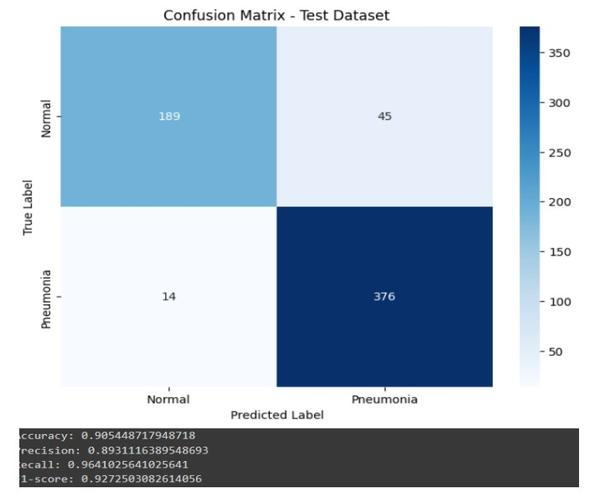
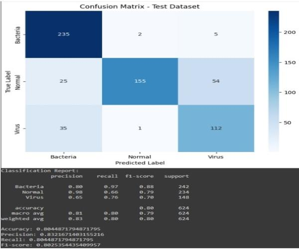
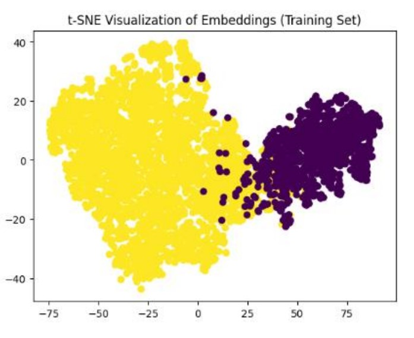
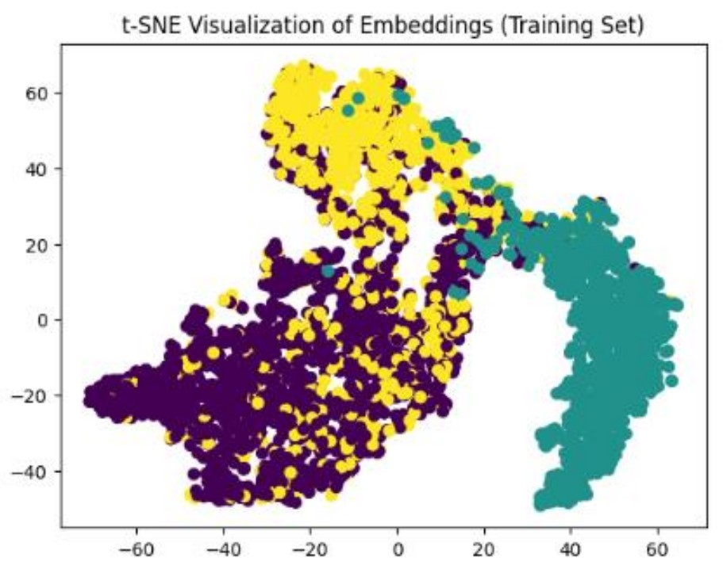
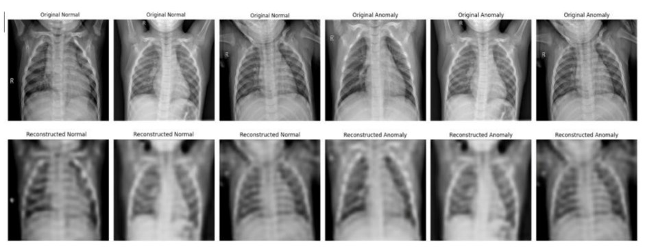

# Pneumonia Detection

## Introduction

This project uses a deep convolutional neural network (CNN) to detect pneumonia in chest X-ray images.

### What is a Convolutional Neural Network?

A deep convolutional neural network (CNN) is a type of artificial neural network specifically designed for processing structured grid data, such as images. CNNs use convolutional layers to automatically and adaptively learn spatial hierarchies of features from input images. This allows the network to recognize patterns, edges, textures, and higher-level features, making them highly effective for image classification and object detection tasks.

## Dataset Distribution

- **Total Images**: 5863 JPEG chest X-ray images.
- **Categories**: 
  - Bacterial Pneumonia
  - Viral Pneumonia
  - Normal
- **Data Split for Traning**:
   - train: 4183 (Viral Pneumonia - 1131, Bacterial Pneumonia - 1979, Normal - 1073)
   - val: 1043 (Viral Pneumonia - 216, Bacterial Pneumonia - 559, Normal - 268)
   - test: 624 (Viral Pneumonia - 148, Bacterial Pneumonia - 242, Normal - 234)

## How to Use

In the project's files, you can find:

1. **Google Colab Notebooks** (inside the `notebooks` folder):
   - **Pneumonia_Detection_Testing.ipynb**: 
     - This notebook allows you to insert an image and receive a prediction.
     - **How to Run**:
       - Open the notebook in Google Colab, follow the instructions in the notebook, and run the cells sequentially. 
         Upload your chest X-ray images when prompted.

   - **Pneumonia_Detection_Training.ipynb**: 
     - This notebook contains details about the training process, including data preprocessing, model architecture, training, and evaluation.
     - **How to Set Up the Dataset for Training**:
       - Open and save a copy of the Google Colab notebook in your Google Drive.
       - Download the dataset from Kaggle. You can find it [here](https://www.kaggle.com/datasets/paultimothymooney/chest-xray-pneumonia).
       - Extract the downloaded files and rename the `chest_xray` folder to `all_the_images`.
       - Create a new folder named `project_ML` in `/content/drive/MyDrive/`.
       - Upload the `all_the_images` folder into the `project_ML` folder in your Google Drive.

         You should have the following structure:

         ```
         content
         └── drive
             └── MyDrive
                 └── project_ML/
                     └── all_the_images/
                        ├── train/
                        │   ├── NORMAL/
                        │   │   ├── image1.jpg
                        │   │   ├── image2.jpg
                        │   │   └── ...
                        │   └── PNEUMONIA/
                        │       ├── image1.jpg
                        │       ├── image2.jpg
                        │       └── ...
                        ├── val/
                        │   ├── NORMAL/
                        │   │   ├── image1.jpg
                        │   │   ├── image2.jpg
                        │   │   └── ...
                        │   └── PNEUMONIA/
                        │       ├── image1.jpg
                        │       ├── image2.jpg
                        │       └── ...
                        └── test/
                            ├── NORMAL/
                            │   ├── image1.jpg
                            │   ├── image2.jpg
                            │   └── ...
                            └── PNEUMONIA/
                                ├── image1.jpg
                                ├── image2.jpg
                                └── ...
  
       - **Note**: The original dataset is not split properly; for training, I resplit the train and validation sets to 80% train and 20% val. You can split the data however you like, but please maintain the folder structure.

     - **How to Run**: 
         1. Open the notebook in Google Colab.
         2. Run the cells sequentially.
         3. After running all the cells, you should have the trained models in the `models_and_weights` folder, structured as follows:

         ```
         content
         └── drive
             └── MyDrive
                └── project_ML/
                   └── models_and_weights/
                      ├── A1/
                      │   ├── model.keras
                      │   └── weights.model.keras
                      ├── A2/
                      │   ├── model.keras
                      │   └── weights.model.keras
                      ├── B/
                      │   ├── binary/
                      │   │   └── knn_classifier.pkl
                      │   └── multiclass/
                      │       └── knn_classifier.pkl
                      └── D/
                          ├── model.keras
                          ├── weights.model.keras
                          └── threshold.txt
         ```

2. **Python Scripts** (inside the `scripts` folder):
   - **pneumonia_detection_testing.py**
   - **pneumonia_detection_training.py**
   These files are in Python format for your convenience.

## Models

This project includes several models for pneumonia detection and classification:

1. **Binary Classification Model**: Classifies images as either Normal or Pneumonia.
2. **Multi-Class Classification Model**: Classifies images into one of three categories: Bacterial Pneumonia, Viral Pneumonia, or Normal.
3. **KNN-based Classification**:
   - **Binary Model**: Classifies new images based on the binary classification model using KNN.
   - **Multi-Class Model**: Classifies new images based on the multi-class classification model using KNN.
4. **Anomaly Detection Model**: Uses an autoencoder to detect anomalies in the images.

## Trained Models

The trained models used for this project are included as a link to a Google Drive folder in the test notebook. You can use these models directly without retraining.

## Results and Performance Examples
 
**Confusion Matrix - Test Set A1 - Binary Class Classification**



**Confusion Matrix - Test Set A2 - Multi-Class Classification**



**Binary t-SNE Visualization**



**Multi-Class t-SNE Visualization**
  


**Original and Reconstructed Images from Anomaly Detection**



## License
This project is licensed under the MIT License. You are free to use, modify, and distribute this project, as long as the original license and attribution are retained. For more details, see the [LICENSE](LICENSE) file.

## Contributing
Feel free to contribute by opening issues or creating pull requests.

## Author
This project was created and is maintained by [RoDanielle](https://github.com/RoDanielle).  
For questions, feel free to reach out via GitHub.
